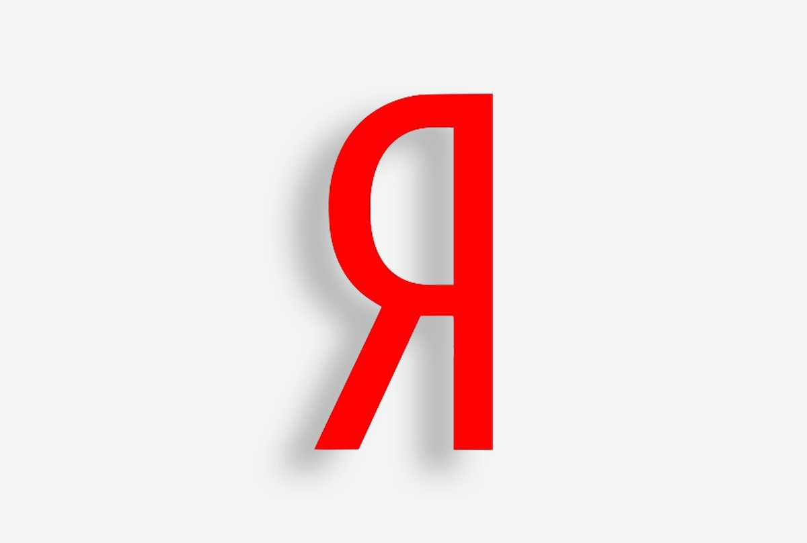

Here will be some **C++** implementations of algorithyms from [Yandex lectures](https://www.youtube.com/playlist?list=PL6Wui14DvQPySdPv5NUqV3i8sDbHkCKC5). 

* Each of implementation or solution contains short **problem explanation** and some **comments** (**Readme**).
